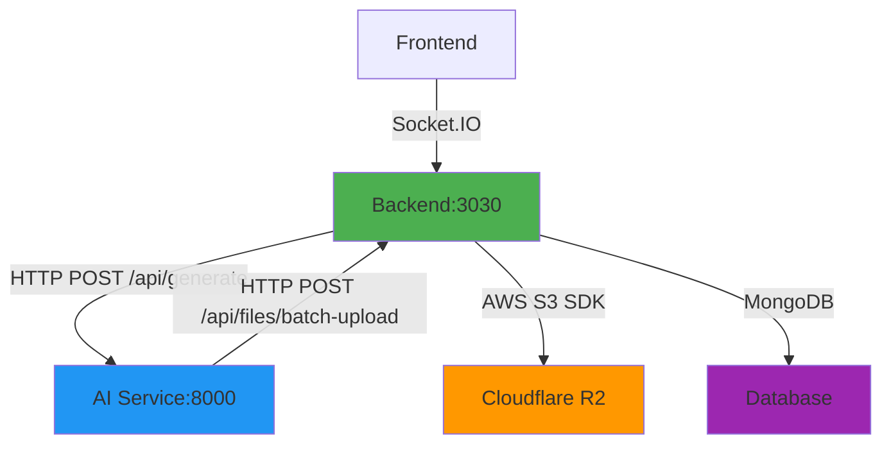

# Backend-AI Service Connection & R2 File Creation Fix Plan

## Overview

This plan addresses 7 critical issues identified in the backend and AI service implementations that affect their connection and R2 file creation logic. The fixes are organized by priority and dependency.

---

## Architecture Diagram



---

## Phase 1: Critical Security Fixes (High Priority)

### Fix 1.1: Add Authentication to `/api/files/batch-upload` Endpoint

**File:** [`../back/src/app.ts`](../back/src/app.ts:84-128)

**Issue:** The endpoint is completely unauthenticated, allowing anyone to upload files.

**Solution:**
```typescript
if (ctx.path === '/api/files/batch-upload') {
  try {
    // ✅ Add authentication check
    const authResult = await app.service('authentication').create(
      {},
      { ...ctx.params, strategy: 'jwt' }
    )
    
    if (!authResult || !authResult.user) {
      ctx.status = 401
      ctx.body = { error: 'Authentication required' }
      return
    }

    const { files } = ctx.request.body as any

    if (!files || !Array.isArray(files)) {
      ctx.status = 400
      ctx.body = { error: 'Missing or invalid files array' }
      return
    }

    const r2Service = app.get('r2Service')
    if (!r2Service) {
      ctx.status = 500
      ctx.body = { error: 'R2 service not configured' }
      return
    }

    const uploadResults: any[] = []

    for (const file of files) {
      const { key, content, contentType = 'application/octet-stream' } = file
      try {
        await r2Service.uploadFile({ key, content, contentType })
        uploadResults.push({ key, success: true })
      } catch (error: any) {
        uploadResults.push({ key, success: false, error: error.message })
      }
    }

    ctx.status = 200
    ctx.body = {
      success: true,
      results: uploadResults,
      uploadedAt: Date.now()
    }
  } catch (error: any) {
    ctx.status = 500
    ctx.body = {
      success: false,
      error: error.message || 'Failed to upload files'
    }
  }
  return
}
```

**Benefits:**
- Prevents unauthorized file uploads
- Aligns with R2 service authentication
- Enables proper error tracking

---

### Fix 1.2: Add Authentication to `/api/files/upload` Endpoint

**File:** [`../back/src/app.ts`](../back/src/app.ts:46-82)

**Issue:** Same as above - no authentication check.

**Solution:** Add the same authentication check as Fix 1.1.

---

## Phase 2: AI Service Upload Logic Fixes (High Priority)

### Fix 2.1: Update AI Service to Use Correct Batch Upload Endpoint

**File:** [`../ai-service/main.py`](../ai-service/main.py:134-150)

**Issue:** `upload_to_r2` function uses wrong URL format.

**Solution:** Remove the broken `upload_to_r2` function and create a new function that calls the backend's batch upload endpoint:

```python
async def upload_files_to_backend(files: list[dict]) -> dict:
    """Upload multiple files to backend's batch upload endpoint"""
    try:
        async with httpx.AsyncClient() as client:
            response = await client.post(
                f"{R2_ENDPOINT}/api/files/batch-upload",
                json={"files": files},
                headers={
                    "Authorization": f"Bearer {R2_ACCESS_KEY}:{R2_SECRET_KEY}"
                },
                timeout=120.0
            )
            response.raise_for_status()
            return response.json()
    except Exception as e:
        print(f"Error uploading files to backend: {e}")
        return {"success": False, "error": str(e)}
```

### Fix 2.2: Update `/api/edit` Endpoint to Use New Upload Function

**File:** [`../ai-service/main.py`](../ai-service/main.py:998-1040)

**Issue:** Uses broken `upload_to_r2` function.

**Solution:**
```python
@app.post("/api/edit")
async def edit_project(request: EditRequest):
    """Edit existing project with new prompt"""
    try:
        # Build conversation context
        context_messages = [
            {"role": "system", "content": "You are an expert backend developer. Edit the existing project files based on the user's request."},
            {"role": "user", "content": request.prompt}
        ]

        # Generate edited files
        full_response = ""
        async for chunk in call_ollama_generate(request.prompt, request.model):
            full_response += chunk

        # Parse the response to extract updated files
        updated_files = {}
        for file_path, content in request.files.items():
            updated_files[file_path] = content

        # ✅ Use new batch upload function
        files_to_upload = []
        for file_path, content in updated_files.items():
            r2_key = f"{request.projectId}/{file_path}"
            files_to_upload.append({
                "key": r2_key,
                "content": content,
                "contentType": "text/plain"
            })

        upload_result = await upload_files_to_backend(files_to_upload)

        if upload_result.get("success"):
            return {
                "success": True,
                "updatedFiles": list(updated_files.keys()),
                "projectId": request.projectId,
                "message": "Project edited successfully"
            }
        else:
            raise HTTPException(status_code=500, detail=upload_result.get("error", "Failed to upload edited files"))

    except Exception as e:
        raise HTTPException(status_code=500, detail=f"Error editing project: {str(e)}")
```

### Fix 2.3: Update `/api/versions` Endpoint

**File:** [`../ai-service/main.py`](../ai-service/main.py:1100-1124)

**Issue:** Uses broken `upload_to_r2` function.

**Solution:** Similar to Fix 2.2, use the new batch upload function.

### Fix 2.4: Remove Unused `download_from_r2` Function

**File:** [`../ai-service/main.py`](../ai-service/main.py:153-168)

**Issue:** Function is unused and uses incorrect URL format.

**Solution:** Remove the function or update it to call backend's R2 service endpoint.

---

## Phase 3: File Metadata Fixes (Medium Priority)

### Fix 3.1: Update File Size After R2 Upload

**File:** [`../back/src/services/projects/projects.ts`](../back/src/services/projects/projects.ts:85-95)

**Issue:** File size is hardcoded to 0 and never updated.

**Solution:**
```typescript
// Create file records for each generated file
if (result.data?.success && result.data.files) {
  const filesService = app.service('files' as any)
  const r2Service = app.get('r2Service')

  for (const filePath of result.data.files) {
    const language = getLanguageFromPath(filePath)
    const r2Key = `${project._id}/${filePath}`
    
    // ✅ Get file size from R2
    let fileSize = 0
    try {
      const fileData = await r2Service.downloadFile(r2Key)
      fileSize = fileData.content.length
    } catch (error) {
      console.error(`Failed to get file size for ${filePath}:`, error)
    }

    await filesService.create({
      projectId: project._id,
      path: filePath,
      r2Key: r2Key,
      language: language,
      size: fileSize,  // ✅ Use actual file size
      currentVersion: 1
    })
  }
}
```

**Alternative Solution:** Pass file sizes from AI service response:

```typescript
if (result.data?.success && result.data.files) {
  const filesService = app.service('files' as any)

  for (const fileData of result.data.files) {
    const { path, size } = fileData  // ✅ AI service includes file sizes
    const language = getLanguageFromPath(path)
    
    await filesService.create({
      projectId: project._id,
      path: path,
      r2Key: `${project._id}/${path}`,
      language: language,
      size: size,  // ✅ Use size from AI service
      currentVersion: 1
    })
  }
}
```

Then update AI service to include file sizes:

```python
# In /api/generate endpoint
uploaded_files = []
for file_path, content in generated_files.items():
    r2_key = f"{request.projectId}/{file_path}" if request.projectId else file_path
    files_to_upload.append({
        "key": r2_key,
        "content": content,
        "contentType": "text/plain"
    })
    uploaded_files.append({
        "path": file_path,
        "size": len(content)  # ✅ Include file size
    })

# Return with file sizes
return {
    "success": True,
    "files": uploaded_files,  # ✅ Now includes path and size
    "projectId": request.projectId,
    "validation": validation.dict(),
    "message": "Code generated and uploaded successfully"
}
```

---

## Phase 4: Configuration & Documentation Improvements (Low Priority)

### Fix 4.1: Clarify R2 Configuration in AI Service

**File:** [`../ai-service/main.py`](../ai-service/main.py:24-28)

**Issue:** Misleading configuration names suggest direct R2 access.

**Solution:** Rename and add comments:

```python
# Backend API configuration (not direct R2 access)
BACKEND_URL = os.getenv("BACKEND_URL", "http://localhost:3030")
BACKEND_API_KEY = os.getenv("BACKEND_API_KEY", "")  # For internal service communication
BACKEND_API_SECRET = os.getenv("BACKEND_API_SECRET", "")

# R2 bucket names (for reference, actual access via backend)
R2_BUCKET_FILES = os.getenv("R2_BUCKET_FILES", "ai-generated-files")
R2_BUCKET_VERSIONS = os.getenv("R2_BUCKET_VERSIONS", "ai-file-versions")
R2_BUCKET_EXPORTS = os.getenv("R2_BUCKET_EXPORTS", "ai-exports")
```

### Fix 4.2: Update AI Service References

**File:** [`../ai-service/main.py`](../ai-service/main.py:134-169)

**Issue:** Old references to `R2_ENDPOINT` and `R2_ACCESS_KEY`.

**Solution:** Update all references to use new configuration names.

---

## Phase 5: Diagnostic Logging (Optional but Recommended)

### Fix 5.1: Add Logging to AI Service

**File:** [`../ai-service/main.py`](../ai-service/main.py:905-978)

**Solution:**
```python
@app.post("/api/generate")
async def generate_code(request: GenerateRequest):
    """Generate code from prompt"""
    try:
        # ✅ Add logging
        print(f"[DEBUG] Generating code for project: {request.projectId}")
        print(f"[DEBUG] Prompt: {request.prompt[:100]}...")
        
        # First validate the prompt
        validation = validate_prompt(request.prompt)
        print(f"[DEBUG] Validation result: {validation.isValid}")
        
        if not validation.isValid:
            print(f"[DEBUG] Validation failed: {validation.reason}")
            return {
                "success": False,
                "validation": validation.dict(),
                "message": "Prompt validation failed"
            }
        
        # Use enhanced prompt if available
        prompt_to_use = validation.enhancedPrompt or request.prompt
        
        # Generate backend code based on prompt analysis
        generated_files = generate_backend_code(
            prompt_to_use, 
            request.framework, 
            request.language
        )
        print(f"[DEBUG] Generated {len(generated_files)} files")

        # Upload files to R2 via backend API
        files_to_upload = []
        for file_path, content in generated_files.items():
            r2_key = f"{request.projectId}/{file_path}" if request.projectId else file_path
            files_to_upload.append({
                "key": r2_key,
                "content": content,
                "contentType": "text/plain"
            })

        print(f"[DEBUG] Uploading {len(files_to_upload)} files to backend")
        
        # Call backend batch upload endpoint
        try:
            async with httpx.AsyncClient() as client:
                response = await client.post(
                    f"{R2_ENDPOINT}/api/files/batch-upload",
                    json={"files": files_to_upload},
                    headers={
                        "Authorization": f"Bearer {R2_ACCESS_KEY}:{R2_SECRET_KEY}"
                    },
                    timeout=120.0
                )
                print(f"[DEBUG] Backend response status: {response.status_code}")
                response.raise_for_status()
                result = response.json()
                print(f"[DEBUG] Backend response: {result}")

                if result.get("success"):
                    uploaded_files = []
                    for file_path in generated_files.keys():
                        uploaded_files.append({
                            "path": file_path,
                            "size": len(generated_files[file_path])
                        })
                    print(f"[DEBUG] Successfully uploaded {len(uploaded_files)} files")
                else:
                    print(f"[DEBUG] Upload failed: {result}")
                    upload_success = False

        except Exception as e:
            print(f"[ERROR] Error uploading files via backend API: {e}")
            import traceback
            traceback.print_exc()
            upload_success = False

        if upload_success:
            return {
                "success": True,
                "files": uploaded_files,
                "projectId": request.projectId,
                "validation": validation.dict(),
                "message": "Code generated and uploaded successfully"
            }
        else:
            raise HTTPException(status_code=500, detail="Failed to upload generated files")

    except Exception as e:
        print(f"[ERROR] Error generating code: {e}")
        import traceback
        traceback.print_exc()
        raise HTTPException(status_code=500, detail=f"Error generating code: {str(e)}")
```

### Fix 5.2: Add Logging to Backend

**File:** [`../back/src/app.ts`](../back/src/app.ts:84-128)

**Solution:**
```typescript
if (ctx.path === '/api/files/batch-upload') {
  try {
    console.log('[DEBUG] Received batch upload request')
    const { files } = ctx.request.body as any
    console.log(`[DEBUG] Number of files to upload: ${files?.length || 0}`)

    // ... authentication check ...

    const r2Service = app.get('r2Service')
    if (!r2Service) {
      console.error('[ERROR] R2 service not configured')
      ctx.status = 500
      ctx.body = { error: 'R2 service not configured' }
      return
    }

    const uploadResults: any[] = []

    for (const file of files) {
      const { key, content, contentType = 'application/octet-stream' } = file
      console.log(`[DEBUG] Uploading file: ${key} (${content.length} bytes)`)
      try {
        await r2Service.uploadFile({ key, content, contentType })
        uploadResults.push({ key, success: true })
        console.log(`[DEBUG] Successfully uploaded: ${key}`)
      } catch (error: any) {
        console.error(`[ERROR] Failed to upload ${key}:`, error)
        uploadResults.push({ key, success: false, error: error.message })
      }
    }

    const successCount = uploadResults.filter(r => r.success).length
    console.log(`[DEBUG] Batch upload complete: ${successCount}/${files.length} successful`)

    ctx.status = 200
    ctx.body = {
      success: true,
      results: uploadResults,
      uploadedAt: Date.now()
    }
  } catch (error: any) {
    console.error('[ERROR] Batch upload error:', error)
    ctx.status = 500
    ctx.body = {
      success: false,
      error: error.message || 'Failed to upload files'
    }
  }
  return
}
```

---

## Implementation Order

### Priority 1 (Critical - Do First)
1. Fix 1.1: Add authentication to `/api/files/batch-upload`
2. Fix 1.2: Add authentication to `/api/files/upload`
3. Fix 2.1: Create new `upload_files_to_backend` function

### Priority 2 (High - Do After Priority 1)
4. Fix 2.2: Update `/api/edit` endpoint
5. Fix 2.3: Update `/api/versions` endpoint
6. Fix 2.4: Remove unused `upload_to_r2` function

### Priority 3 (Medium - Do After Priority 2)
7. Fix 3.1: Update file size after R2 upload

### Priority 4 (Low - Do After Priority 3)
8. Fix 4.1: Clarify R2 configuration
9. Fix 4.2: Update AI service references

### Priority 5 (Optional - Do Anytime)
10. Fix 5.1: Add logging to AI service
11. Fix 5.2: Add logging to backend

---

## Testing Checklist

After implementing fixes, verify:

- [ ] AI service can successfully generate code
- [ ] AI service uploads files to backend via `/api/files/batch-upload`
- [ ] Backend receives and processes batch upload requests
- [ ] Files are uploaded to Cloudflare R2 successfully
- [ ] File metadata (size) is correctly stored in database
- [ ] `/api/edit` endpoint works correctly
- [ ] `/api/versions` endpoint works correctly
- [ ] Authentication is properly enforced
- [ ] Unauthorized requests are rejected
- [ ] Error handling works as expected

---

## Rollback Plan

If any fix causes issues:

1. **Revert changes** to the specific file
2. **Check logs** to identify the problem
3. **Test previous state** to confirm functionality
4. **Implement alternative solution** if needed

---

## Success Criteria

The fixes are successful when:

1. ✅ All endpoints are properly authenticated
2. ✅ AI service uploads files using correct endpoint format
3. ✅ Files are successfully uploaded to R2
4. ✅ File metadata is accurate (including size)
5. ✅ No security vulnerabilities remain
6. ✅ Error handling is robust
7. ✅ Logging provides visibility into the process

---

## Estimated Complexity

- **Phase 1 (Security):** Low complexity, high impact
- **Phase 2 (Upload Logic):** Medium complexity, high impact
- **Phase 3 (Metadata):** Low complexity, medium impact
- **Phase 4 (Configuration):** Low complexity, low impact
- **Phase 5 (Logging):** Low complexity, medium impact

**Total Estimated Effort:** 2-3 hours for all phases

---

## Notes

- The AI service should NOT directly access Cloudflare R2
- All file uploads should go through the backend's `/api/files/batch-upload` endpoint
- The backend handles the actual R2 uploads using AWS S3 SDK
- Authentication is critical for security
- Logging is essential for debugging production issues
