# Mockline Backend - Comprehensive Frontend Implementation Analysis

## Executive Summary

This document provides a comprehensive analysis of the Mockline backend architecture, focusing on frontend implementation details, service connections, data flow, and integration points. The backend is built on **Feathers.js v5** with **Koa**, **MongoDB**, **Redis**, and **Ollama** for AI-powered code generation.

---

## Table of Contents

1. [Project Overview](#project-overview)
2. [Technology Stack](#technology-stack)
3. [Architecture Overview](#architecture-overview)
4. [Core Services](#core-services)
5. [Service Connections & Data Flow](#service-connections--data-flow)
6. [Frontend Integration Points](#frontend-integration-points)
7. [API Endpoints Reference](#api-endpoints-reference)
8. [Real-time Communication](#real-time-communication)
9. [Authentication & Authorization](#authentication--authorization)
10. [Storage & File Management](#storage--file-management)
11. [AI/LLM Integration](#aillm-integration)
12. [Queue System](#queue-system)
13. [Data Models](#data-models)
14. [Visual Diagrams](#visual-diagrams)

---

## 1. Project Overview

**Mockline** is an AI-powered code generation platform that allows users to create backend projects through natural language prompts. The platform generates complete, production-ready code with features like:

- **AI-Powered Code Generation**: Generate FastAPI or Feathers.js backends from prompts
- **Real-time Progress Tracking**: Monitor generation progress via WebSocket events
- **File Management**: Upload, edit, and manage project files
- **Version Control (Snapshots)**: Create and restore project snapshots
- **AI Assistant**: Interactive AI chat for code improvements and debugging
- **Multi-User Support**: Firebase and JWT-based authentication

---

## 2. Technology Stack

### Backend Framework

- **Feathers.js v5**: Real-time microservices framework
- **Koa**: Web framework for HTTP middleware
- **TypeScript**: Type-safe development

### Database & Storage

- **MongoDB**: Primary database for projects, files, users, messages, snapshots
- **Redis**: Queue management and caching
- **Cloudflare R2 (S3-compatible)**: Object storage for project files and snapshots

### AI/LLM

- **Ollama**: Local LLM inference (model: `qwen2.5-coder:7b`)
- **BullMQ**: Job queue for async code generation

### Authentication

- **JWT**: JSON Web Tokens for session management
- **Firebase Admin**: Firebase authentication integration
- **Local Strategy**: Email/password authentication

### Real-time Communication

- **Socket.IO**: WebSocket-based real-time events
- **REST API**: Standard HTTP endpoints

---

## 3. Architecture Overview

### System Architecture

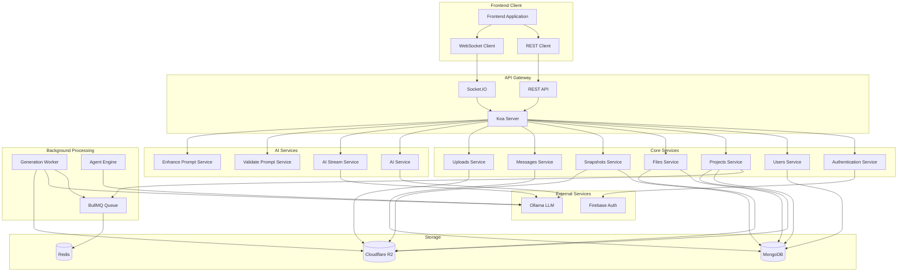

### Application Bootstrap Flow

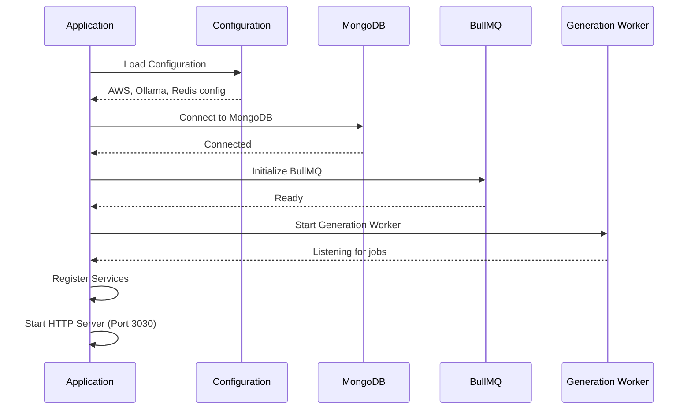

---

## 4. Core Services

### 4.1 Users Service

**Path**: `/users`

**Purpose**: Manage user accounts and authentication data.

**Schema**:

```typescript
{
    _id: ObjectId;
    email: string;
    password: string; // Hashed
    name: string;
    createdAt: number;
    updatedAt: number;
}
```

**Methods**:

- `find(params)`: List users (requires JWT)
- `get(id, params)`: Get user by ID (requires JWT)
- `create(data, params)`: Create new user (public)
- `patch(id, data, params)`: Update user (requires JWT)
- `remove(id, params)`: Delete user (requires JWT)

**Authentication Strategies**:

- **JWT**: Default token-based authentication
- **Local**: Email/password
- **Firebase**: Firebase token authentication

**Frontend Integration**:

```typescript
// Login with JWT
await client.authenticate({
    strategy: 'jwt',
    accessToken: 'your-jwt-token'
});

// Login with Firebase
await client.authenticate({
    strategy: 'firebase',
    accessToken: 'firebase-id-token'
});

// Create user
const user = await client.service('users').create({
    email: 'user@example.com',
    password: 'secure-password',
    name: 'John Doe'
});
```

---

### 4.2 Projects Service

**Path**: `/projects`

**Purpose**: Manage AI-generated backend projects with real-time progress tracking.

**Schema**:

```typescript
{
  _id: ObjectId;
  userId: ObjectId;
  name: string;
  description: string;
  framework: 'fast-api' | 'feathers';
  language: 'python' | 'typescript';
  model: string;
  status: 'initializing' | 'generating' | 'validating' | 'ready' | 'error';
  errorMessage?: string;
  jobId?: string;
  generationProgress: {
    percentage: number; // 0-100
    currentStage: string;
    currentFile?: string;
    filesGenerated: number;
    totalFiles: number;
    startedAt?: number;
    completedAt?: number;
    errorMessage?: string;
  };
  createdAt: number;
  updatedAt: number;
  deletedAt?: number;
}
```

**Methods**:

- `find(params)`: List user's projects (filtered by userId)
- `get(id, params)`: Get project details
- `create(data, params)`: Create new project and trigger AI generation
- `patch(id, data, params)`: Update project status/progress
- `remove(id, params)`: Soft-delete project

**Lifecycle Flow**:

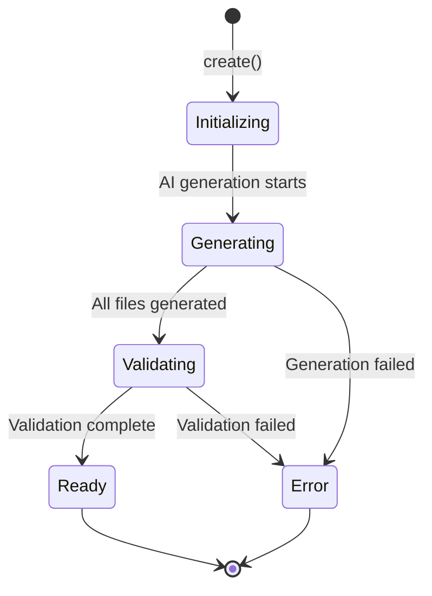

**Frontend Integration**:

```typescript
// Create a new project
const project = await client.service('projects').create({
    name: 'My E-commerce API',
    description: 'A REST API for e-commerce with user authentication, product management, and order processing',
    framework: 'fast-api',
    language: 'python'
});

// Listen to progress events
client.service('projects').on('progress', (data) => {
    console.log('Progress:', data);
    // {
    //   projectId: '...',
    //   status: 'generating',
    //   progress: { percentage: 45, currentStage: 'generating_files', ... }
    // }
});

// Join project channel for real-time updates
client.io.emit('join-project', projectId);

// List projects
const projects = await client.service('projects').find({
    query: { userId: currentUser._id }
});

// Get project details
const project = await client.service('projects').get(projectId);
```

**Events**:

- `progress`: Emitted when generation progress updates
- `created`: Emitted when project is created
- `patched`: Emitted when project is updated
- `removed`: Emitted when project is deleted

---

### 4.3 Files Service

**Path**: `/files`

**Purpose**: Manage project files stored in R2 with database metadata.

**Schema**:

```typescript
{
  _id: ObjectId;
  projectId: ObjectId;
  messageId?: ObjectId;
  name: string;
  key: string; // R2 storage path
  fileType: string;
  size: number;
  currentVersion: number;
  createdAt: number;
  updatedAt: number;
}
```

**Methods**:

- `find(params)`: List files for a project
- `get(id, params)`: Get file metadata
- `create(data, params)`: Create file record (after upload)
- `patch(id, data, params)`: Update file metadata
- `remove(id, params)`: Delete file and R2 object

**Frontend Integration**:

```typescript
// List files for a project
const files = await client.service('files').find({
    query: { projectId: 'project-id' }
});

// Get file metadata
const file = await client.service('files').get(fileId);

// Delete file (cascades to R2)
await client.service('files').remove(fileId);
```

**Events**:

- `created`: Emitted when file is added
- `patched`: Emitted when file is updated
- `removed`: Emitted when file is deleted

---

### 4.4 Snapshots Service

**Path**: `/snapshots`

**Purpose**: Version control for projects with rollback capabilities.

**Schema**:

```typescript
{
    _id: ObjectId;
    projectId: ObjectId;
    version: number;
    label: string;
    trigger: 'auto-generation' | 'auto-ai-edit' | 'manual';
    r2Prefix: string;
    files: Array<{
        fileId: ObjectId;
        name: string;
        key: string;
        r2SnapshotKey: string;
        size: number;
        fileType: string;
    }>;
    totalSize: number;
    fileCount: number;
    createdAt: number;
}
```

**Methods**:

- `find(params)`: List snapshots for a project
- `get(id, params)`: Get snapshot details
- `create(data, params)`: Create snapshot (copies files to R2)
- `patch(id, data, params)`: Rollback to snapshot (special action)
- `remove(id, params)`: Delete snapshot and R2 copies

**Frontend Integration**:

```typescript
// Create manual snapshot
const snapshot = await client.service('snapshots').create({
    projectId: 'project-id',
    label: 'Before major refactor',
    trigger: 'manual'
});

// List snapshots
const snapshots = await client.service('snapshots').find({
    query: { projectId: 'project-id', $sort: { version: -1 } }
});

// Rollback to snapshot
const result = await client.service('snapshots').patch(snapshotId, {
    action: 'rollback'
});
// Returns: { success: true, restoredVersion: 2, projectId: '...', fileCount: 10 }

// Delete snapshot
await client.service('snapshots').remove(snapshotId);
```

**Automatic Snapshots**:

- Created after initial project generation
- Created before AI-suggested edits are applied
- Created before rollback operations (safety snapshot)

---

### 4.5 Messages Service

**Path**: `/messages`

**Purpose**: Store conversation history with AI assistant.

**Schema**:

```typescript
{
  _id: ObjectId;
  projectId: ObjectId;
  role: 'user' | 'system' | 'assistant';
  type: 'text' | 'file';
  content: string;
  tokens?: number;
  status?: string;
  createdAt: number;
  updatedAt: number;
}
```

**Methods**:

- `find(params)`: List messages for a project
- `get(id, params)`: Get message details
- `create(data, params)`: Create new message
- `patch(id, data, params)`: Update message
- `remove(id, params)`: Delete message

**Frontend Integration**:

```typescript
// List conversation history
const messages = await client.service('messages').find({
    query: { projectId: 'project-id', $sort: { createdAt: 1 } }
});

// Create user message
const message = await client.service('messages').create({
    projectId: 'project-id',
    role: 'user',
    type: 'text',
    content: 'How do I add authentication to this API?'
});

// Listen for new messages
client.service('messages').on('created', (message) => {
    if (message.projectId === currentProjectId) {
        appendToChat(message);
    }
});
```

---

### 4.6 Uploads Service

**Path**: `/uploads`

**Purpose**: Handle multipart file uploads to R2 storage.

**Methods**:

- `create(data)`: Initialize multipart upload
- `patch(id, data)`: Upload a chunk
- `update(id, data, params)`: Complete multipart upload
- `remove(id, params)`: Abort upload or delete file

**Frontend Integration**:

```typescript
// Initialize upload
const { uploadId, key } = await client.service('uploads').create({
    key: `projects/${projectId}/${filename}`,
    contentType: 'text/plain'
});

// Upload chunks
const chunkSize = 5 * 1024 * 1024; // 5MB
const parts = [];
for (let i = 0; i < chunks.length; i++) {
    const part = await client.service('uploads').patch(null, {
        uploadId,
        key,
        partNumber: i + 1,
        content: chunks[i]
    });
    parts.push({ PartNumber: part.PartNumber, ETag: part.ETag });
}

// Complete upload
const fileId = await client.service('uploads').update(null, {
    uploadId,
    key,
    parts,
    fileType: 'python',
    projectId,
    originalFilename: 'main.py'
});
```

---

### 4.7 AI Services

#### AI Service (`/ai-service`)

**Purpose**: Enqueue code generation jobs.

**Methods**:

- `create(data)`: Queue generation job
- `find()`: Health check

**Frontend Integration**:

```typescript
// Trigger code generation
const result = await client.service('ai-service').create({
    projectId: 'project-id',
    prompt: 'Create a REST API for task management'
});
// Returns: { jobId: '...', status: 'generating' }

// Health check
const health = await client.service('ai-service').find();
// Returns: { service: 'ai-generator', status: 'running', ollama: { reachable: true }, model: 'qwen2.5-coder:7b' }
```

#### AI Stream Service (`/ai-stream`)

**Purpose**: Stream AI responses for interactive chat.

**Methods**:

- `create(data)`: Stream AI response with real-time chunks

**Frontend Integration**:

```typescript
// Stream AI response
client.service('ai-stream').create({
    projectId: 'project-id',
    message: 'How do I add user authentication?',
    conversationHistory: [
        { role: 'user', content: 'Create a task API' },
        { role: 'assistant', content: 'I created a task management API...' }
    ],
    context: {
        files: ['main.py', 'models.py'],
        selectedFile: 'main.py',
        selectedContent: '...'
    }
});

// Listen to stream chunks
client.io.on('ai-stream::chunk', (data) => {
    console.log('Chunk:', data.content);
    // Append to streaming response
});

client.io.on('ai-stream::file-updates', (data) => {
    console.log('File updates:', data.updates);
    // Display suggested file changes
});
```

#### Validate Prompt Service (`/validate-prompt`)

**Purpose**: Validate and enhance user prompts before generation.

**Methods**:

- `create(data)`: Validate prompt and return suggestions

#### Enhance Prompt Service (`/enhance-prompt`)

**Purpose**: Improve prompt quality for better generation results.

---

### 4.8 Server Monitor Service

**Path**: `/server-monitor`

**Purpose**: Monitor system health and resource usage.

**Methods**:

- `find()`: Get system metrics

---

## 5. Service Connections & Data Flow

### 5.1 Project Creation Flow

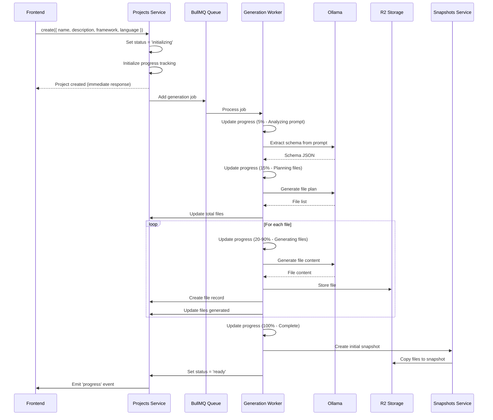

### 5.2 AI Chat Flow

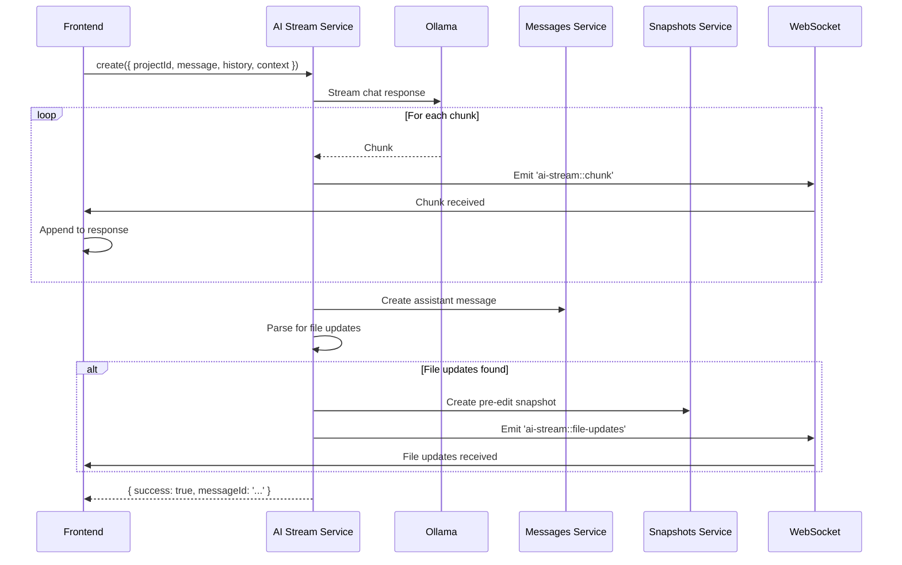

### 5.3 Snapshot Rollback Flow

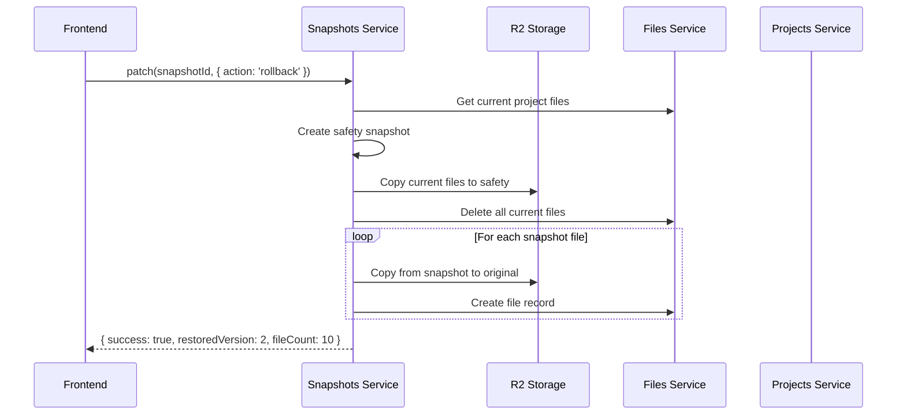

---

## 6. Frontend Integration Points

### 6.1 Client Setup

```typescript
import { createClient, socketio } from '@feathersjs/client';
import io from 'socket.io-client';

// Create client with Socket.IO
const socket = io('http://localhost:3030', {
    transports: ['websocket'],
    reconnection: true,
    reconnectionDelay: 1000,
    reconnectionAttempts: 5
});

const client = createClient(socketio(socket));

// Configure authentication
try {
    await client.authenticate({
        strategy: 'jwt',
        accessToken: localStorage.getItem('feathers-jwt')
    });
} catch (error) {
    console.error('Authentication failed:', error);
    // Handle authentication failure (redirect to login, show error message, etc.)
}

// Setup re-authentication on reconnect
client.on('reauthentication', (error) => {
    if (error) {
        console.error('Re-authentication failed:', error);
        // Handle re-authentication failure
    } else {
        console.log('Re-authenticated successfully');
    }
});
```

### 6.2 Authentication Flow

```typescript
// Login with email/password
try {
    const authResult = await client.authenticate({
        strategy: 'local',
        email: 'user@example.com',
        password: 'password'
    });

    // Store JWT token for future requests
    localStorage.setItem('feathers-jwt', authResult.accessToken);

    // Get current user
    const user = await client.service('users').get(authResult.user._id);
    console.log('Logged in as:', user);
} catch (error) {
    console.error('Login failed:', error);
    throw error;
}

// Login with Firebase
try {
    const firebaseToken = await firebase.auth().currentUser.getIdToken();
    const authResult = await client.authenticate({
        strategy: 'firebase',
        accessToken: firebaseToken
    });

    localStorage.setItem('feathers-jwt', authResult.accessToken);
    const user = await client.service('users').get(authResult.user._id);
    console.log('Logged in as:', user);
} catch (error) {
    console.error('Firebase login failed:', error);
    throw error;
}

// Logout
try {
    await client.logout();
    localStorage.removeItem('feathers-jwt');
    console.log('Logged out successfully');
} catch (error) {
    console.error('Logout failed:', error);
    throw error;
}
```

### 6.3 Project Management

```typescript
// Create project
const project = await client.service('projects').create({
    name: 'My API',
    description: 'A REST API for...',
    framework: 'fast-api',
    language: 'python'
});

// List projects
const projects = await client.service('projects').find({
    query: {
        userId: currentUser._id,
        $sort: { createdAt: -1 }
    }
});

// Get project details
const project = await client.service('projects').get(projectId);

// Update project
const updated = await client.service('projects').patch(projectId, {
    name: 'Updated Name'
});

// Delete project
await client.service('projects').remove(projectId);
```

### 6.4 Real-time Progress Tracking

```typescript
// Join project channel
client.io.emit('join-project', projectId);

// Listen to progress events
client.service('projects').on('progress', (data) => {
    console.log('Progress update:', data);
    // Update UI with progress bar
    updateProgressBar(data.progress.percentage);
    updateStage(data.progress.currentStage);
});

// Listen to project updates
client.service('projects').on('patched', (project) => {
    if (project._id === projectId) {
        updateProjectStatus(project.status);
    }
});

// Leave project channel
client.io.emit('leave-project', projectId);
```

### 6.5 File Management

```typescript
// List files
const files = await client.service('files').find({
    query: { projectId }
});

// Upload file (multipart)
const uploadFile = async (file: File) => {
    const { uploadId, key } = await client.service('uploads').create({
        key: `projects/${projectId}/${file.name}`,
        contentType: file.type
    });

    const chunks = [];
    const chunkSize = 5 * 1024 * 1024; // 5MB
    for (let start = 0; start < file.size; start += chunkSize) {
        const chunk = file.slice(start, start + chunkSize);
        chunks.push(chunk);
    }

    const parts = [];
    for (let i = 0; i < chunks.length; i++) {
        const part = await client.service('uploads').patch(null, {
            uploadId,
            key,
            partNumber: i + 1,
            content: chunks[i]
        });
        parts.push({ PartNumber: part.PartNumber, ETag: part.ETag });
    }

    const fileId = await client.service('uploads').update(null, {
        uploadId,
        key,
        parts,
        fileType: file.name.split('.').pop(),
        projectId,
        originalFilename: file.name
    });

    return fileId;
};

// Delete file
await client.service('files').remove(fileId);
```

### 6.6 Snapshot Management

```typescript
// Create snapshot
const snapshot = await client.service('snapshots').create({
    projectId,
    label: 'Before refactoring',
    trigger: 'manual'
});

// List snapshots
const snapshots = await client.service('snapshots').find({
    query: {
        projectId,
        $sort: { version: -1 }
    }
});

// Rollback to snapshot
const result = await client.service('snapshots').patch(snapshotId, {
    action: 'rollback'
});

// Delete snapshot
await client.service('snapshots').remove(snapshotId);
```

### 6.7 AI Chat Integration

```typescript
// Stream AI response
const streamResponse = async (message: string, context?: any) => {
    const history = await client.service('messages').find({
        query: { projectId, $sort: { createdAt: 1 } }
    });

    await client.service('ai-stream').create({
        projectId,
        message,
        conversationHistory: history.data,
        context
    });
};

// Listen to stream chunks
client.io.on('ai-stream::chunk', (data) => {
    console.log('Chunk:', data.content);
    // Append to streaming response UI
});

// Listen to file updates
client.io.on('ai-stream::file-updates', (data) => {
    console.log('File updates:', data.updates);
    // Display suggested changes
    data.updates.forEach((update) => {
        showFileUpdate(update);
    });
});
```

---

## 7. API Endpoints Reference

### REST Endpoints

| Method | Path               | Description              | Auth Required |
| ------ | ------------------ | ------------------------ | ------------- |
| POST   | `/authentication`  | Authenticate user        | No            |
| POST   | `/users`           | Create user              | No            |
| GET    | `/users`           | List users               | Yes           |
| GET    | `/users/:id`       | Get user                 | Yes           |
| PATCH  | `/users/:id`       | Update user              | Yes           |
| DELETE | `/users/:id`       | Delete user              | Yes           |
| POST   | `/projects`        | Create project           | Yes           |
| GET    | `/projects`        | List projects            | Yes           |
| GET    | `/projects/:id`    | Get project              | Yes           |
| PATCH  | `/projects/:id`    | Update project           | Yes           |
| DELETE | `/projects/:id`    | Delete project           | Yes           |
| POST   | `/files`           | Create file              | Yes           |
| GET    | `/files`           | List files               | Yes           |
| GET    | `/files/:id`       | Get file                 | Yes           |
| PATCH  | `/files/:id`       | Update file              | Yes           |
| DELETE | `/files/:id`       | Delete file              | Yes           |
| POST   | `/snapshots`       | Create snapshot          | Yes           |
| GET    | `/snapshots`       | List snapshots           | Yes           |
| GET    | `/snapshots/:id`   | Get snapshot             | Yes           |
| PATCH  | `/snapshots/:id`   | Update/rollback snapshot | Yes           |
| DELETE | `/snapshots/:id`   | Delete snapshot          | Yes           |
| POST   | `/messages`        | Create message           | Yes           |
| GET    | `/messages`        | List messages            | Yes           |
| GET    | `/messages/:id`    | Get message              | Yes           |
| PATCH  | `/messages/:id`    | Update message           | Yes           |
| DELETE | `/messages/:id`    | Delete message           | Yes           |
| POST   | `/uploads`         | Initialize upload        | No            |
| PATCH  | `/uploads`         | Upload chunk             | No            |
| PUT    | `/uploads/:id`     | Complete upload          | No            |
| DELETE | `/uploads/:id`     | Abort/delete upload      | No            |
| POST   | `/ai-service`      | Queue generation         | Yes           |
| GET    | `/ai-service`      | Health check             | Yes           |
| POST   | `/ai-stream`       | Stream AI response       | Yes           |
| POST   | `/validate-prompt` | Validate prompt          | Yes           |
| POST   | `/enhance-prompt`  | Enhance prompt           | Yes           |
| GET    | `/server-monitor`  | Get system metrics       | Yes           |

### WebSocket Events

#### Client → Server

| Event           | Payload                 | Description           |
| --------------- | ----------------------- | --------------------- |
| `join-project`  | `{ projectId: string }` | Join project channel  |
| `leave-project` | `{ projectId: string }` | Leave project channel |

#### Server → Client

| Event                     | Payload                                     | Description                |
| ------------------------- | ------------------------------------------- | -------------------------- |
| `projects::progress`      | `{ projectId, status, progress, ... }`      | Generation progress update |
| `projects::created`       | `Project`                                   | Project created            |
| `projects::patched`       | `Project`                                   | Project updated            |
| `projects::removed`       | `Project`                                   | Project deleted            |
| `files::created`          | `File`                                      | File created               |
| `files::patched`          | `File`                                      | File updated               |
| `files::removed`          | `File`                                      | File deleted               |
| `snapshots::created`      | `Snapshot`                                  | Snapshot created           |
| `snapshots::patched`      | `Snapshot`                                  | Snapshot updated           |
| `snapshots::removed`      | `Snapshot`                                  | Snapshot deleted           |
| `messages::created`       | `Message`                                   | Message created            |
| `messages::patched`       | `Message`                                   | Message updated            |
| `messages::removed`       | `Message`                                   | Message deleted            |
| `ai-stream::chunk`        | `{ projectId, content, fullContent, done }` | AI stream chunk            |
| `ai-stream::file-updates` | `{ projectId, updates: [...] }`             | File update suggestions    |
| `generation:progress`     | `{ stage, percentage, currentFile }`        | Generation worker progress |

---

## 8. Real-time Communication

### Channel Architecture

The backend uses Feathers.js channels for real-time event distribution:

```typescript
// Project-scoped channels
app.channel(`projects/${projectId}`); // All users in a project

// Authenticated channel
app.channel('authenticated'); // All authenticated users

// Anonymous channel
app.channel('anonymous'); // Unauthenticated connections
```

### Event Publishing Rules

```typescript
// Messages → Project channel or authenticated
app.service('messages').publish((data) => {
    return data.projectId ? app.channel(`projects/${data.projectId}`) : app.channel('authenticated');
});

// Projects → Project channel or authenticated
app.service('projects').publish((data) => {
    return data._id ? app.channel(`projects/${data._id}`) : app.channel('authenticated');
});

// Files → Project channel or authenticated
app.service('files').publish((data) => {
    return data.projectId ? app.channel(`projects/${data.projectId}`) : app.channel('authenticated');
});

// Snapshots → Project channel or authenticated
app.service('snapshots').publish((data) => {
    return data.projectId ? app.channel(`projects/${data.projectId}`) : app.channel('authenticated');
});

// AI Stream → Project channel only
app.service('ai-stream').publish((data) => {
    return app.channel(`projects/${data.projectId}`);
});
```

### Frontend Event Handling

```typescript
// Join project channel
client.io.emit('join-project', projectId);

// Listen to service events
client.service('projects').on('progress', (data) => {
    console.log('Progress:', data);
});

client.service('files').on('created', (file) => {
    if (file.projectId === projectId) {
        addFileToUI(file);
    }
});

// Listen to custom Socket.IO events
client.io.on('ai-stream::chunk', (data) => {
    console.log('AI chunk:', data.content);
});

// Leave project channel
client.io.emit('leave-project', projectId);
```

---

## 9. Authentication & Authorization

### Authentication Strategies

#### 1. JWT Strategy (Default)

```typescript
// Login
const authResult = await client.authenticate({
    strategy: 'jwt',
    accessToken: 'your-jwt-token'
});

// Token is sent in Authorization header
// Authorization: Bearer <token>
```

#### 2. Local Strategy

```typescript
// Login with email/password
const authResult = await client.authenticate({
    strategy: 'local',
    email: 'user@example.com',
    password: 'password'
});
```

#### 3. Firebase Strategy

```typescript
// Login with Firebase token
const authResult = await client.authenticate({
    strategy: 'firebase',
    accessToken: 'firebase-id-token'
});
```

### JWT Configuration

```json
{
    "authentication": {
        "entity": "user",
        "service": "users",
        "secret": "your-jwt-secret-key-here",
        "authStrategies": ["jwt", "local", "firebase"],
        "jwtOptions": {
            "header": { "typ": "access" },
            "audience": "https://mockline.dev",
            "algorithm": "HS256",
            "expiresIn": "1d"
        }
    }
}
```

**Note:** Replace `"your-jwt-secret-key-here"` with a secure, randomly generated secret in production.

### Authorization Hooks

All services use the `authenticate('jwt')` hook to require authentication:

```typescript
app.service(projectsPath).hooks({
    around: {
        all: [authenticate('jwt')]
    }
});
```

### User Context in Services

The authenticated user is available in `params.user`:

```typescript
async (context: HookContext) => {
    const { user } = context.params;
    context.data.userId = user._id;
    return context;
};
```

### Rate Limiting

The AI service uses rate limiting:

```typescript
rateLimit({
    windowSeconds: 3600, // 1 hour
    maxRequests: 10, // Max 10 requests per hour
    keyPrefix: 'generation'
});
```

---

## 10. Storage & File Management

### R2 Storage Configuration

```json
{
    "aws": {
        "endpoint": "https://your-r2-endpoint.r2.cloudflarestorage.com",
        "region": "your-region",
        "accessKeyId": "your-access-key-id",
        "secretAccessKey": "your-secret-access-key",
        "bucket": "mockline-projects"
    },
    "r2PublicUrl": "https://your-public-url.r2.dev"
}
```

**Note:** Replace placeholder values with your actual Cloudflare R2 credentials in production.

### Storage Paths

```
projects/
  {projectId}/
    main.py
    models.py
    routes.py
    ...

snapshots/
  {projectId}/
    v1/
      main.py
      models.py
    v2/
      main.py
      models.py
```

### File Upload Flow

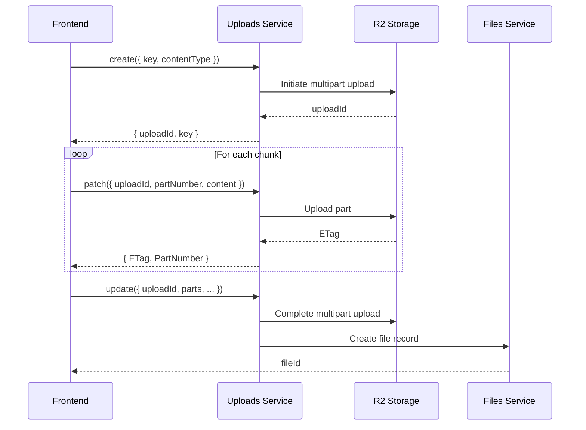

### R2 Client Methods

```typescript
// Get file content
const content = await r2Client.getObject(`projects/${projectId}/main.py`);

// Put file content
await r2Client.putObject(`projects/${projectId}/main.py`, content, 'text/x-python');

// Delete file
await r2Client.deleteObject(`projects/${projectId}/main.py`);

// List files
const files = await r2Client.listObjects(`projects/${projectId}/`);

// Check if file exists
const exists = await r2Client.exists(`projects/${projectId}/main.py`);

// Copy file
await r2Client.copyObject(`source/path`, `dest/path`);

// Copy prefix (batch)
await r2Client.copyPrefix(`projects/${projectId}/`, `snapshots/${projectId}/v1/`);

// Delete prefix (batch)
await r2Client.deletePrefix(`projects/${projectId}/`);
```

---

## 11. AI/LLM Integration

### Ollama Configuration

```json
{
    "ollama": {
        "baseUrl": "http://localhost:11434",
        "model": "qwen2.5-coder:7b",
        "numPredict": 16384,
        "numCtx": 32768,
        "temperature": 0.3,
        "topP": 0.9,
        "repeatPenalty": 1.1,
        "timeout": 120000
    }
}
```

### Code Generation Pipeline

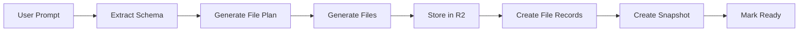

### Generation Prompts

The system uses structured prompts for each phase:

1. **Schema Extraction**: Extract data models and API structure
2. **File Planning**: Determine which files to create
3. **File Generation**: Generate each file with context

### Agent Engine

The agent engine supports tool-calling for complex operations:

```typescript
// Agent tools available
const AGENT_TOOLS = [
    {
        type: 'function',
        function: {
            name: 'read_file',
            description: 'Read a file from the project',
            parameters: { type: 'object', properties: { path: { type: 'string' } } }
        }
    },
    {
        type: 'function',
        function: {
            name: 'write_file',
            description: 'Write or update a file',
            parameters: { type: 'object', properties: { path: { type: 'string' }, content: { type: 'string' } } }
        }
    },
    {
        type: 'function',
        function: {
            name: 'list_files',
            description: 'List files in the project',
            parameters: { type: 'object', properties: { path: { type: 'string' } } }
        }
    },
    {
        type: 'function',
        function: {
            name: 'finish',
            description: 'Complete the task',
            parameters: { type: 'object', properties: { summary: { type: 'string' } } }
        }
    }
];
```

### AI Stream Response Format

The AI stream service returns file update suggestions in a structured format:

````
FILE_UPDATE: main.py
ACTION: modify
DESCRIPTION: Add authentication middleware

```python
from fastapi import FastAPI, Depends, HTTPException
from fastapi.security import HTTPBearer

security = HTTPBearer()

async def get_current_user(token: str = Depends(security)):
    """Validate JWT token and return current user."""
    ...
````

The frontend should parse this format and display the suggested changes to the user.

````

---

## 12. Queue System

### BullMQ Configuration

```json
{
  "redis": {
    "url": "redis://localhost:6379"
  }
}
````

### Generation Worker

```typescript
// Worker configuration
const generationWorker = new Worker(
    'code-generation',
    async (job) => {
        // Process generation job
    },
    {
        connection: redisConnection,
        concurrency: 3 // Process 3 jobs concurrently
    }
);
```

### Job Lifecycle

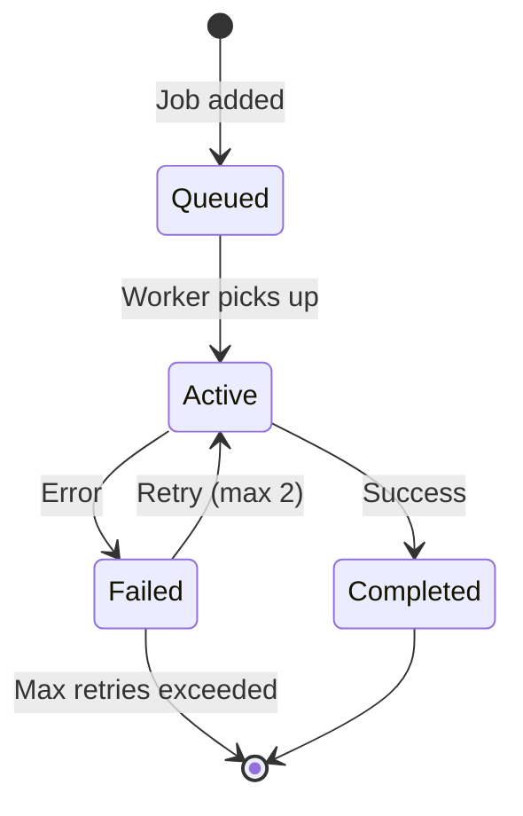

### Job Data Structure

```typescript
interface GenerationJobData {
    projectId: string;
    prompt: string;
    userId: string;
    model: string;
}
```

### Progress Updates

The worker emits progress updates via WebSocket:

```typescript
// Update progress
await updateProgress('Generating files', 45, 'main.py');

// Emits to project channel
app.channel(`projects/${projectId}`).send({
    type: 'generation:progress',
    payload: { stage: 'Generating files', percentage: 45, currentFile: 'main.py' }
});
```

---

## 13. Data Models

### Users

```typescript
interface User {
    _id: ObjectId;
    email: string;
    password: string; // Hashed
    name: string;
    createdAt: number;
    updatedAt: number;
}
```

### Projects

```typescript
interface Project {
    _id: ObjectId;
    userId: ObjectId;
    name: string;
    description: string;
    framework: 'fast-api' | 'feathers';
    language: 'python' | 'typescript';
    model: string;
    status: 'initializing' | 'generating' | 'validating' | 'ready' | 'error';
    errorMessage?: string;
    jobId?: string;
    generationProgress: {
        percentage: number;
        currentStage: string;
        currentFile?: string;
        filesGenerated: number;
        totalFiles: number;
        startedAt?: number;
        completedAt?: number;
        errorMessage?: string;
    };
    createdAt: number;
    updatedAt: number;
    deletedAt?: number;
}
```

### Files

```typescript
interface File {
    _id: ObjectId;
    projectId: ObjectId;
    messageId?: ObjectId;
    name: string;
    key: string; // R2 path
    fileType: string;
    size: number;
    currentVersion: number;
    createdAt: number;
    updatedAt: number;
}
```

### Snapshots

```typescript
interface Snapshot {
    _id: ObjectId;
    projectId: ObjectId;
    version: number;
    label: string;
    trigger: 'auto-generation' | 'auto-ai-edit' | 'manual';
    r2Prefix: string;
    files: Array<{
        fileId: ObjectId;
        name: string;
        key: string;
        r2SnapshotKey: string;
        size: number;
        fileType: string;
    }>;
    totalSize: number;
    fileCount: number;
    createdAt: number;
}
```

### Messages

```typescript
interface Message {
    _id: ObjectId;
    projectId: ObjectId;
    role: 'user' | 'system' | 'assistant';
    type: 'text' | 'file';
    content: string;
    tokens?: number;
    status?: string;
    createdAt: number;
    updatedAt: number;
}
```

---

## 14. Visual Diagrams

### Complete System Architecture

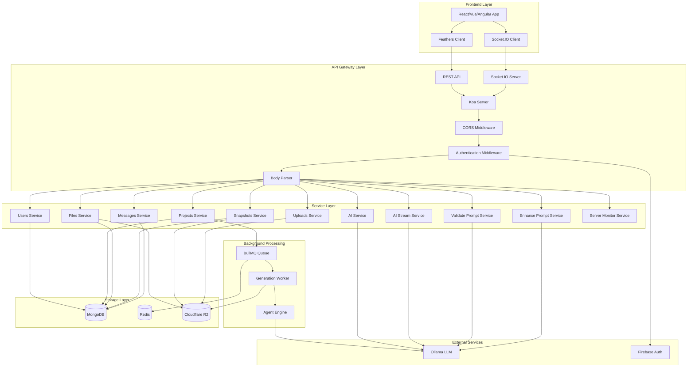

### Project Generation Flow

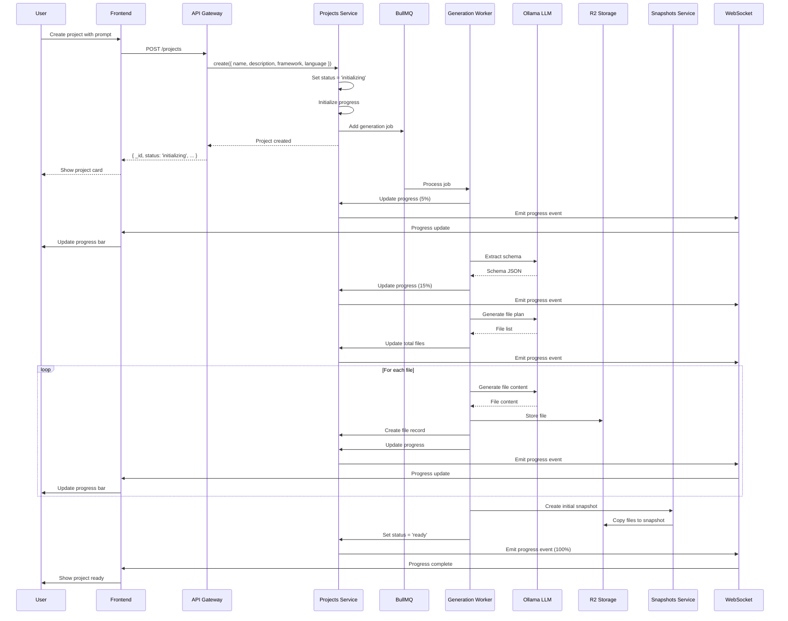

### AI Chat Flow

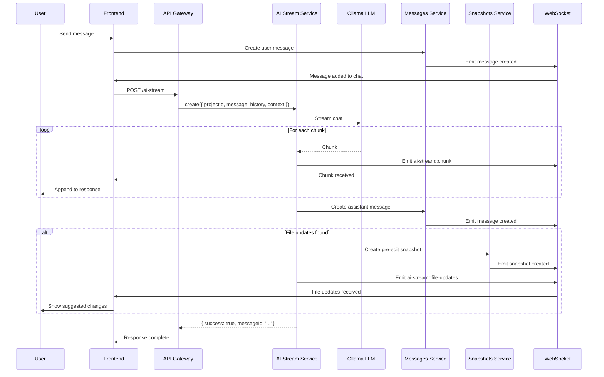

### Snapshot Rollback Flow

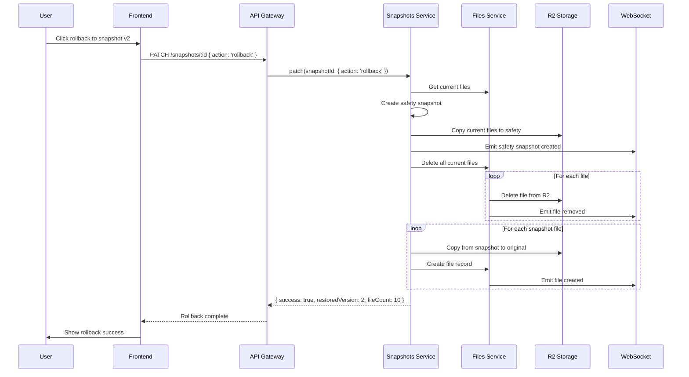

---

## Conclusion

This comprehensive analysis provides frontend developers with all the necessary information to integrate with the Mockline backend. Key takeaways:

1. **Feathers.js Client**: Use the Feathers client for seamless API and real-time communication
2. **Authentication**: JWT, Firebase, and local strategies available
3. **Real-time Events**: Join project channels to receive progress and update events
4. **Service Patterns**: All services follow consistent CRUD patterns with hooks
5. **Storage**: Files stored in R2 with metadata in MongoDB
6. **AI Integration**: Stream responses and handle file update suggestions
7. **Snapshots**: Automatic and manual snapshots with rollback capability
8. **Rate Limiting**: AI services have rate limits (10 requests/hour)

For specific implementation questions, refer to the service files in `src/services/` and the client setup in `src/services/featherClient.ts` or `src/services/feathersServer.ts`.
